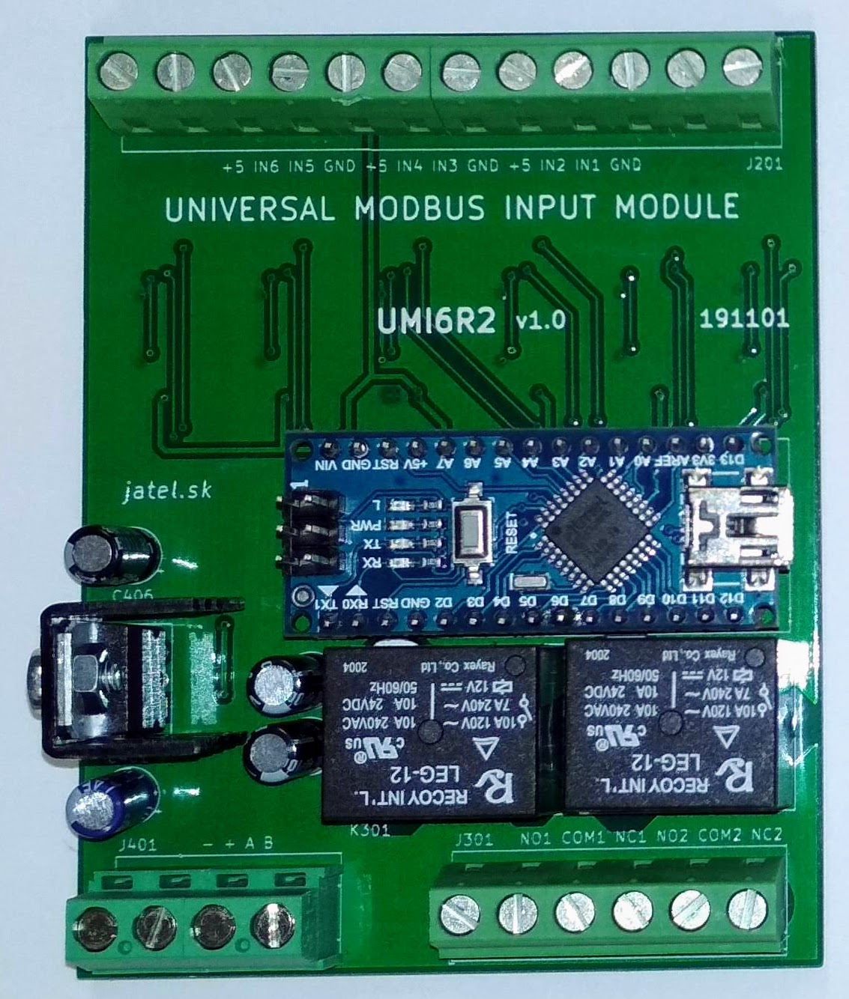

# UMI6R2
## Universal modbus inputs module
**Specification:**  
Supply: 12 - 30V / 50mA  
Core: Arduino Nano  
Number of inputs: 6  
Input types: TTL / TTL with pull-up 2k2 / 0-10V / 1-10V / 0-20mA / 4-20mA  
Number of outputs: 2  
Output types: relay contact 10A/240VAC  
Communication: Modbus RTU 485  
Mounting: [DIN 4M](https://www.tme.eu/sk/en/details/4mh53_5/din-rail-mounting-enclosures/italtronic/)  

  

#### Description
Low cost universal modbus controll unit for low cost sensors and actuators from China:  
[NTC](https://www.aliexpress.com/item/1005001645557005.html?spm=a2g0o.productlist.0.0.187f54f5sMFDxZ&algo_pvid=9de88852-8f4a-408b-ad87-1dfdc50c90a6&algo_expid=9de88852-8f4a-408b-ad87-1dfdc50c90a6-12&btsid=2100bb5116140376819446860eae3f&ws_ab_test=searchweb0_0,searchweb201602_,searchweb201603_)  
 [Hall Flow Sensor](https://www.aliexpress.com/item/1005001652070023.html?spm=a2g0o.productlist.0.0.111d3f4bfW8KI7&algo_pvid=0e9d849e-a274-4857-9695-266535420252&algo_expid=0e9d849e-a274-4857-9695-266535420252-3&btsid=0b0a0ae216140368139255250ee091&ws_ab_test=searchweb0_0,searchweb201602_,searchweb201603_)  
[DHT22](https://www.aliexpress.com/item/32759901711.html?spm=a2g0o.productlist.0.0.7c9b27acyKxgzN&algo_pvid=cdfb1f8e-0449-4fde-b37e-72250bef6eec&algo_expid=cdfb1f8e-0449-4fde-b37e-72250bef6eec-1&btsid=2100bddf16140369182308517e6039&ws_ab_test=searchweb0_0,searchweb201602_,searchweb201603_)  
[DS18B20](https://www.aliexpress.com/item/4000895660165.html?spm=a2g0o.productlist.0.0.6e117a31a0Jav1&algo_pvid=1cb9bcee-23eb-4e23-812d-128fc839b4cb&algo_expid=1cb9bcee-23eb-4e23-812d-128fc839b4cb-4&btsid=2100bb5116140369607362637eb05f&ws_ab_test=searchweb0_0,searchweb201602_,searchweb201603_)  
[Pressure Sensor](https://www.aliexpress.com/item/1447040260.html?spm=a2g0o.productlist.0.0.542b418eIxJRxZ&algo_pvid=66da158e-1870-4b2f-a303-d273c240283c&algo_expid=66da158e-1870-4b2f-a303-d273c240283c-0&btsid=2100bdd516140372507935255e4c69&ws_ab_test=searchweb0_0,searchweb201602_,searchweb201603_)  
[Electric Valve](https://www.aliexpress.com/item/4000279793000.html?spm=a2g0o.productlist.0.0.721212089kHY2M&algo_pvid=9ae05a60-6b6b-4111-a46f-0fc823cf62b9&algo_expid=9ae05a60-6b6b-4111-a46f-0fc823cf62b9-30&btsid=0bb0624316140370036014582e4170&ws_ab_test=searchweb0_0,searchweb201602_,searchweb201603_)  
[Electric Solenoid Valve](https://www.aliexpress.com/item/4000067341651.html?spm=a2g0o.productlist.0.0.721212089kHY2M&algo_pvid=9ae05a60-6b6b-4111-a46f-0fc823cf62b9&algo_expid=9ae05a60-6b6b-4111-a46f-0fc823cf62b9-31&btsid=0bb0624316140370036014582e4170&ws_ab_test=searchweb0_0,searchweb201602_,searchweb201603_)  
etc...